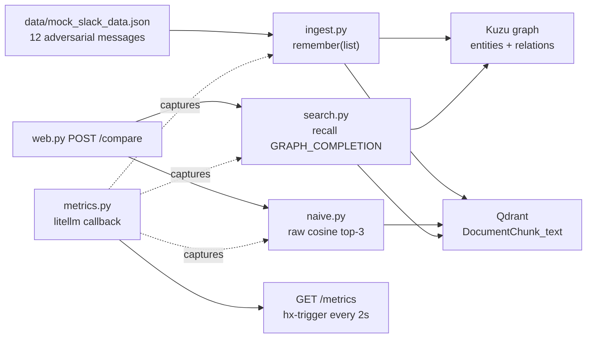
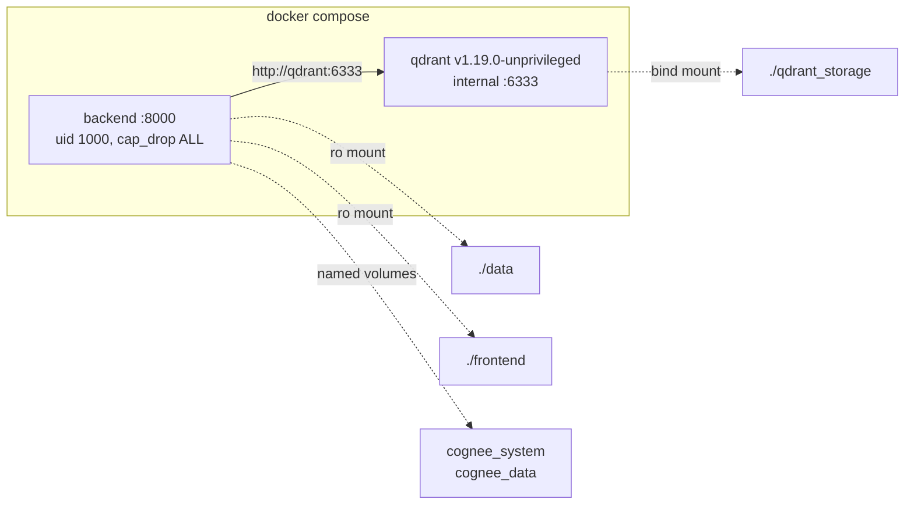

# ContextDrift — Cross-Channel Slack Memory Sentinel

Engineering context fragments across Slack channels: an outage is reported in `#incident-alerts`, diagnosed in `#backend-dev`, and shipped in `#releases`. Ask a vector search "was the checkout bug fixed?" and it returns the panic, never the fix — because the message announcing the fix shares almost no vocabulary with the question.

ContextDrift builds a typed knowledge graph over Slack history with [Cognee](https://www.cognee.ai/), retrieves through [Qdrant](https://www.qdrant.tech/), and traces the dependency chain end to end: outage to root cause to async migration to the release that resolved it. Every claim carries provenance back to the original Slack message (channel, author, timestamp).

It also detects **drift** — decisions that vector search still ranks highly but that were later reversed. A blocker from three hours ago is not current state, and a memory layer that cannot tell the difference will confidently hand you a stale answer.


## Architecture




The corpus is Slack-shaped (`data/mock_slack_data.json`, 12 messages). Answers also land in Slack through Cognee's official app (`/cognee-ask`, `/cognee-remember`, `/cognee-link`) once the workspace is connected at `/integrations`. The Qdrant community adapter still declares `cognee==1.4.2`; a uv `override-dependencies` pin to `cognee==1.5.0.dev1` is what makes that official Slack stack available — empirically `register` + `remember` + `recall` round-trip on 1.5.0.dev1. Bulk channel history is still our ingest pipeline: the official app omits `channels:history`.

## Compose topology



Both services drop Linux capabilities and run as uid 1000. The backend image starts as root only long enough to chown the named volumes, then `setpriv` to `app`. Qdrant is `qdrant/qdrant:v1.19.0-unprivileged` with a read-only rootfs; **6333/6334 are not published** — the backend reaches it as `http://qdrant:6333` on the compose network. LanceDB/pyarrow are omitted from the backend image (we use Qdrant). The runtime image still includes uv so `docker compose run --rm backend uv run pytest` works.

## Quickstart

Requires Docker Compose and an OpenAI API key (`gpt-4o-mini` + `text-embedding-3-small`).

```bash
cp .env.example .env
```

Set `OPENAI_API_KEY` in `.env`. Leave `VECTOR_DB_URL=http://qdrant:6333`.

```bash
docker compose up --build
```

Open [http://localhost:8000](http://localhost:8000). Click **Ingest corpus**, wait for the one-shot `remember()` pipeline to finish, then **Compare** on the preset query `was the checkout 504 bug fixed?`.

The app healthcheck is [http://localhost:8000/health](http://localhost:8000/health).

## Connect Slack (native `/cognee-ask`)

The FastAPI app already mounts Cognee's official Slack routes. You do not write a bot. You create a Slack app, put its secrets in `.env`, tunnel port 8000, and click **Connect Slack**.

| What you need | Where it comes from |
|---|---|
| ngrok | [ngrok.com/download](https://ngrok.com/download) — run `ngrok http 8000`, copy the `*.ngrok-free.app` host |
| Slack app | [api.slack.com/apps](https://api.slack.com/apps) → **Create New App** → **From an app manifest** → paste `slack-app-manifest.yml` (after replacing `YOUR_NGROK_HOST`) |
| `SLACK_CLIENT_ID` | that app → **Basic Information** → App Credentials → Client ID |
| `SLACK_CLIENT_SECRET` | same page → Client Secret (Show) |
| `SLACK_SIGNING_SECRET` | same page → Signing Secret (Show) |
| `SLACK_REDIRECT_URI` | `https://<ngrok-host>/api/v1/integrations/slack/callback` |
| `SLACK_FRONTEND_BASE_URL` | `http://localhost:8000` — not ngrok |
| `INTEGRATION_CREDENTIALS_KEY` | generate locally: `python3 -c "import os,base64; print(base64.b64encode(os.urandom(32)).decode())"` |

Then: restart the backend → [http://localhost:8000/integrations](http://localhost:8000/integrations) (every pill **set**) → **Connect Slack** → in the workspace `/cognee-link`, then `/cognee-ask was the checkout 504 bug fixed?`.

The click-by-click version is the comment block at the top of `slack-app-manifest.yml`.

Optional CLI ingest (same pipeline, no UI):

```bash
docker compose run --rm backend uv run python -m contextdrift.ingest
```

## Why the baseline is a real Qdrant query

The left panel is not a simulated straw man. `naive.py` embeds the query with `text-embedding-3-small` and hits the same Qdrant `DocumentChunk_text` collection Cognee wrote during ingest, returning cosine top-3 with scores. That collection stores a **named** vector `text`; Qdrant 1.19 rejects `query_points` without `using="text"` (`Not existing vector name error: ""`).

Graph traversal is the only variable: both panels share the collection and the embedding model. The adversarial corpus is built so lexical overlap points at the incident report, a marketing-site 504 decoy, and a superseded blocker — never at the lexically disjoint hotfix in `#releases`.

## How cost is measured

Every Cognee LLM call routes through LiteLLM. `metrics.py` registers a `CustomLogger` success callback that records model, tokens in/out, cost in USD, and latency into an in-process ring buffer tagged by phase (`ingest`, `graph_recall`, `naive_embed`). Cognee's `SessionModelUsage` table is the fallback if no callback events arrive.

The number that sells the pitch is **cost per correct answer** — undefined for the baseline, because its numerator is zero. Panels show absolute spend per query side by side, plus the one-time ingest cost. Qdrant is self-hosted, so retrieval is $0 marginal and 100% of spend is LLM tokens.

The monitor fragment at `GET /metrics` is polled every 2s via `hx-trigger`. There is no separate cost dashboard and no LangSmith — the same in-process tracker feeds the console. Slack is for `/cognee-ask`, not a 2s poll.

## Tests

```bash
docker compose run --rm backend uv run pytest -q \
  tests/test_naive.py tests/test_search.py tests/test_web.py \
  tests/test_config.py tests/test_ingest.py tests/test_integration.py
```

Unit tests mock Qdrant and the LLM (positive hits, missing collection, named-vector 400 captured, Slack placeholder env, empty ingest). `tests/test_integration.py` hits the live Qdrant on the compose network and skips if `/readyz` is down. pytest-xdist runs 2 workers (Cognee import makes `-n auto` slower). Pass `-n0` for a single process.

## 2-minute demo script

Rehearse once with a timer. Bracketed values are filled from the live `/metrics` panel.

**0:00–0:20 — The problem.** "An outage gets reported in `#incident-alerts`, diagnosed in `#backend-dev`, and shipped in `#releases`. Three channels, three days, one story. Ask any vector search 'was the checkout bug fixed?' and it hands you the panic, never the fix — because the fix doesn't share a single keyword with the question."

**0:20–0:50 — The baseline, live.** Run the preset query. Point at the left panel. "This is real Qdrant search, not a straw man — same collection, same embedding model as our system, top three by cosine. Result one is the original 504 report. Result two is a *different* 504, on the marketing site, totally unrelated. Result three is Marcus saying he's blocking the release and rolling back. Every hit is lexically perfect and the answer is wrong — and note the third one is a decision that was reversed three hours later."

**0:50–1:25 — ContextDrift.** Point right. "Same query, same Qdrant, plus Cognee's knowledge graph. It traces outage to root cause to the async migration to the release that shipped it, and tells you it's resolved by PR #405. Every claim carries a provenance chip back to the Slack message — channel, author, timestamp. And it flags Marcus's blocker as superseded, because the graph knows a later decision overrode it. That's the drift: your memory said 'blocked' long after reality said 'shipped.'"

**1:25–1:50 — Cost.** Switch to the monitoring panel. "We instrumented every LLM call through litellm. Naive search costs [X] per query. ContextDrift costs [Y]. Yes, that's [N] times more — and it's the only one that's right, so cost per *correct* answer for the baseline is undefined. Qdrant is self-hosted, so retrieval is $0 marginal; every cent here is tokens. One-time ingest for the whole corpus was [Z]."

**1:50–2:00 — Close.** "Point it at Jira or your codebase and nothing changes but the loader. The memory layer is the product."

If asked why the Qdrant adapter declared `cognee==1.4.2`: a declared pin is not proof of incompatibility. We forced `cognee==1.5.0.dev1` with uv `override-dependencies` and verified `register` + `remember` + `recall` against a scratch Qdrant collection.

## Future work

- **LangChain / LangGraph / LangSmith.** Cognee already owns orchestration; a state machine around a single `recall()` adds no signal. LiteLLM already yields model, tokens, cost, and latency, so LangSmith would duplicate the callback with an extra API key and network dependency.
- **Loaders** for Jira and the codebase — the graph and cost tracker stay the same.
- **Multi-stage backend image** to drop the uv binary after install (~50MB). Dev deps (`ruff`, `pytest`) stay in this image so the compose test command keeps working.
